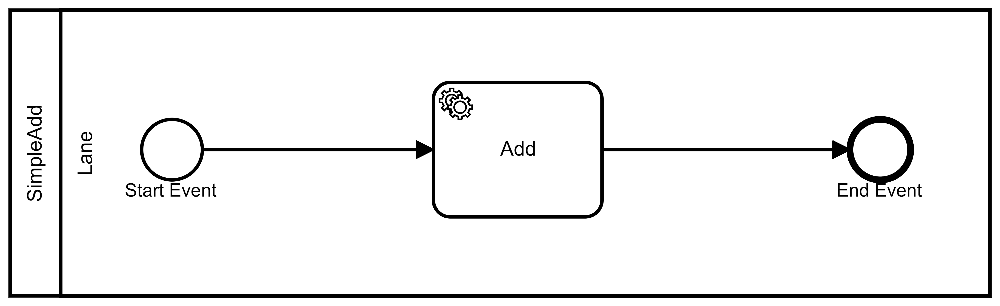

.. _03-Samples:

=======
Samples
=======

We'll assume you already have a working Atlas Engine instance with your
own processes, but for the sake of simplicity the following tutorials are 
using the *SimpleAdd* process residing in the ``/samples`` folder. 

Every sample uses the official NuGet packages.

.. toctree::
   :maxdepth: 1

   03-01-StartAProcessInstance
   03-02-SimpleWorker
   03-03-HostedService
